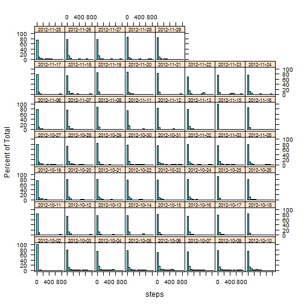
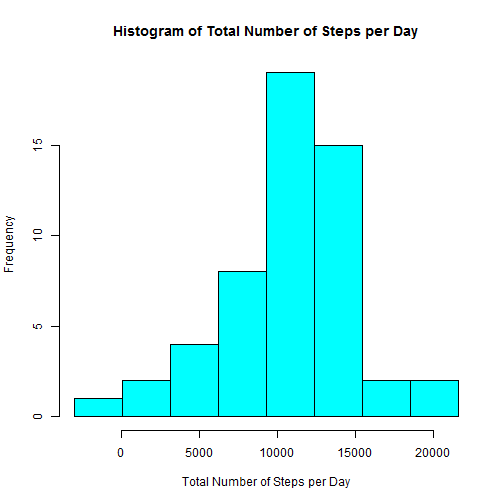

This assignment is part of the Coursera Reproducible Research Module of Data Science. 

This assignment makes use of data from a personal activity monitoring device. This device collects data at 5 minute intervals through out the day. The data consists of two months of data from an anonymous individual collected during the months of October and November, 2012 and include the number of steps taken in 5 minute intervals each day.

The data is contained in the course web site  

  - Dataset: [Activity monitoring data](https://d396qusza40orc.cloudfront.net/repdata%2Fdata%2Factivity.zip) [52K] as a ZIP file  

## Loading and preprocessing the data

Lets make sure we load all the libray we need first


```r
#install.packages("dplyr", "KernSmooth", "knitr", "lattice", "plotrix")
library(dplyr)
library(KernSmooth)
library(knitr)
library(lattice)
library(plotrix)
library(grid)
library(gridExtra)
library(ggplot2)
#library(printr)
```

Download the above data file and unzip the activity.csv to your working directory.   
Assumes the **activity.csv** file is in the working directory.   
We will condition the data as we step through the analysis.   


```r
rawData <- read.csv("activity.csv", stringsAsFactor=FALSE)
str(rawData)
```

```
## 'data.frame':	17568 obs. of  3 variables:
##  $ steps   : int  NA NA NA NA NA NA NA NA NA NA ...
##  $ date    : chr  "2012-10-01" "2012-10-01" "2012-10-01" "2012-10-01" ...
##  $ interval: int  0 5 10 15 20 25 30 35 40 45 ...
```

```r
summary(rawData)
```

```
##      steps            date              interval     
##  Min.   :  0.00   Length:17568       Min.   :   0.0  
##  1st Qu.:  0.00   Class :character   1st Qu.: 588.8  
##  Median :  0.00   Mode  :character   Median :1177.5  
##  Mean   : 37.38                      Mean   :1177.5  
##  3rd Qu.: 12.00                      3rd Qu.:1766.2  
##  Max.   :806.00                      Max.   :2355.0  
##  NA's   :2304
```
Notice there are several thousand NA's in the {steps} column


## What is mean total number of steps taken per day?

For this question we will disregard the NA's by removing them from the data frame. 


```r
ActivityNoNA <- rawData[complete.cases(rawData),]
```

Notice that the NA's have been removed.   
Now lets just create a new column on the data frame which is the date time column. 

**Watchout:** DPLYR package - you cannot use strptime() as it create POSIXlt data types which the by_group does not handle. So we use as.POSIXct() to convert  


```r
# Create character representation of the intervals in form HH:MM
hrs <- paste(sprintf("%02d", ActivityNoNA$interval%/%100), 
             sprintf("%02d", ActivityNoNA$interval%%100), sep=":") 

# Create a new column for the data frame 
date_time <- as.POSIXct(paste(ActivityNoNA$date, hrs), "%Y-%m-%d %H:%M", tz="GMT")
ActivityNoNA$date_time <- date_time
```

Looking at the summary stats

```r
summary(ActivityNoNA)
```

```
##      steps            date              interval     
##  Min.   :  0.00   Length:15264       Min.   :   0.0  
##  1st Qu.:  0.00   Class :character   1st Qu.: 588.8  
##  Median :  0.00   Mode  :character   Median :1177.5  
##  Mean   : 37.38                      Mean   :1177.5  
##  3rd Qu.: 12.00                      3rd Qu.:1766.2  
##  Max.   :806.00                      Max.   :2355.0  
##    date_time                  
##  Min.   :2012-10-02 00:00:00  
##  1st Qu.:2012-10-16 05:58:45  
##  Median :2012-10-29 11:57:30  
##  Mean   :2012-10-31 05:09:57  
##  3rd Qu.:2012-11-16 17:56:15  
##  Max.   :2012-11-29 23:55:00
```

Now we will group the data frame by day and calculate the mean. For this we will use the DPLYR package


```r
by_days <- group_by(ActivityNoNA, date)
mean_by_day <- summarise(by_days, mean_steps = mean(steps))
total_by_day <- summarise(by_days, sum_steps = sum(steps))
stats_by_day <- summarise(by_days, 
                          mean_steps = mean(steps), 
                          total_steps = sum(steps),
                          median_steps = median(steps))
print.data.frame(stats_by_day)
```

```
##          date mean_steps total_steps median_steps
## 1  2012-10-02  0.4375000         126            0
## 2  2012-10-03 39.4166667       11352            0
## 3  2012-10-04 42.0694444       12116            0
## 4  2012-10-05 46.1597222       13294            0
## 5  2012-10-06 53.5416667       15420            0
## 6  2012-10-07 38.2465278       11015            0
## 7  2012-10-09 44.4826389       12811            0
## 8  2012-10-10 34.3750000        9900            0
## 9  2012-10-11 35.7777778       10304            0
## 10 2012-10-12 60.3541667       17382            0
## 11 2012-10-13 43.1458333       12426            0
## 12 2012-10-14 52.4236111       15098            0
## 13 2012-10-15 35.2048611       10139            0
## 14 2012-10-16 52.3750000       15084            0
## 15 2012-10-17 46.7083333       13452            0
## 16 2012-10-18 34.9166667       10056            0
## 17 2012-10-19 41.0729167       11829            0
## 18 2012-10-20 36.0937500       10395            0
## 19 2012-10-21 30.6284722        8821            0
## 20 2012-10-22 46.7361111       13460            0
## 21 2012-10-23 30.9652778        8918            0
## 22 2012-10-24 29.0104167        8355            0
## 23 2012-10-25  8.6527778        2492            0
## 24 2012-10-26 23.5347222        6778            0
## 25 2012-10-27 35.1354167       10119            0
## 26 2012-10-28 39.7847222       11458            0
## 27 2012-10-29 17.4236111        5018            0
## 28 2012-10-30 34.0937500        9819            0
## 29 2012-10-31 53.5208333       15414            0
## 30 2012-11-02 36.8055556       10600            0
## 31 2012-11-03 36.7048611       10571            0
## 32 2012-11-05 36.2465278       10439            0
## 33 2012-11-06 28.9375000        8334            0
## 34 2012-11-07 44.7326389       12883            0
## 35 2012-11-08 11.1770833        3219            0
## 36 2012-11-11 43.7777778       12608            0
## 37 2012-11-12 37.3784722       10765            0
## 38 2012-11-13 25.4722222        7336            0
## 39 2012-11-15  0.1423611          41            0
## 40 2012-11-16 18.8923611        5441            0
## 41 2012-11-17 49.7881944       14339            0
## 42 2012-11-18 52.4652778       15110            0
## 43 2012-11-19 30.6979167        8841            0
## 44 2012-11-20 15.5277778        4472            0
## 45 2012-11-21 44.3993056       12787            0
## 46 2012-11-22 70.9270833       20427            0
## 47 2012-11-23 73.5902778       21194            0
## 48 2012-11-24 50.2708333       14478            0
## 49 2012-11-25 41.0902778       11834            0
## 50 2012-11-26 38.7569444       11162            0
## 51 2012-11-27 47.3819444       13646            0
## 52 2012-11-28 35.3576389       10183            0
## 53 2012-11-29 24.4687500        7047            0
```

### Calculate the total number of steps taken per day

Showing the ***Total number of steps by day***

```r
print.data.frame(total_by_day)
```

```
##          date sum_steps
## 1  2012-10-02       126
## 2  2012-10-03     11352
## 3  2012-10-04     12116
## 4  2012-10-05     13294
## 5  2012-10-06     15420
## 6  2012-10-07     11015
## 7  2012-10-09     12811
## 8  2012-10-10      9900
## 9  2012-10-11     10304
## 10 2012-10-12     17382
## 11 2012-10-13     12426
## 12 2012-10-14     15098
## 13 2012-10-15     10139
## 14 2012-10-16     15084
## 15 2012-10-17     13452
## 16 2012-10-18     10056
## 17 2012-10-19     11829
## 18 2012-10-20     10395
## 19 2012-10-21      8821
## 20 2012-10-22     13460
## 21 2012-10-23      8918
## 22 2012-10-24      8355
## 23 2012-10-25      2492
## 24 2012-10-26      6778
## 25 2012-10-27     10119
## 26 2012-10-28     11458
## 27 2012-10-29      5018
## 28 2012-10-30      9819
## 29 2012-10-31     15414
## 30 2012-11-02     10600
## 31 2012-11-03     10571
## 32 2012-11-05     10439
## 33 2012-11-06      8334
## 34 2012-11-07     12883
## 35 2012-11-08      3219
## 36 2012-11-11     12608
## 37 2012-11-12     10765
## 38 2012-11-13      7336
## 39 2012-11-15        41
## 40 2012-11-16      5441
## 41 2012-11-17     14339
## 42 2012-11-18     15110
## 43 2012-11-19      8841
## 44 2012-11-20      4472
## 45 2012-11-21     12787
## 46 2012-11-22     20427
## 47 2012-11-23     21194
## 48 2012-11-24     14478
## 49 2012-11-25     11834
## 50 2012-11-26     11162
## 51 2012-11-27     13646
## 52 2012-11-28     10183
## 53 2012-11-29      7047
```

Looking at the data we can see that there are a lot of slots with no steps. Below we show a histogram of steps by day.


```r
histogram(~steps | date, data=by_days, par.strip.text=list(cex=0.7))
```

 

If we look at an xyplot we can see that there are definite times where activity takes place


```r
xyplot(steps ~ interval | date, data=by_days, par.strip.text=list(cex=0.7))
```

 


### Histogram of total number of steps taken each day

A histogram plots the frequency of a variable. In our case we want to plot a histogram of the total number of steps per day. The trick is to decide on the optimal bin size to choose as our variable is a continous range.

We can select a histogram bin size by using the R function [**dpih()**](https://stat.ethz.ch/R-manual/R-devel/library/KernSmooth/html/dpih.html)

We use the output of **dpih()** to determine the optimal bin size. This method for selecting the bin width of a histogram is described in Wand(1995) 


```r
# Lets strip out the total steps
tbd <- total_by_day[[2]]
h <- dpih(tbd)
# Calculate the bins 
bins <- seq(min(tbd)-h, max(tbd)+h, by=h)
# Plot the histogram
hist(tbd, breaks=bins, main="Histogram of Total Number of Steps per Day",
     xlab="Total Number of Steps per Day",
     col="cyan")
```

 

Compare this to the default histogram plot using **histogram**


```r
hst1 <- histogram(~ tbd, data=total_by_day,
                main = "Histogram of Total Number of Steps per Day - No NA's",
                xlab = "Total Number of Steps per Day")
hst1 
```

 


### Calculate the mean and median of the total number of steps taken each day

Again using the summarise function lets get **mean** and **median**


```r
overall <- summarise(total_by_day, 
                mean_total_steps = mean(sum_steps),
                median_total_steps = median(sum_steps))
print.data.frame(overall)
```

```
##   mean_total_steps median_total_steps
## 1         10766.19              10765
```


## What is the average daily activity pattern?

We group the steps by the interval across all the days and then get an average. 
We used a polar plot to show the activity on a clock face. This uses the package **plotrix** and the useful function **clock24.plot()**


```r
by_int <- group_by(ActivityNoNA, interval)
avg_steps_int <- summarise(by_int, mean_steps = mean(steps))

# Prepare the data for polar ploting
pos3 <- (avg_steps_int$interval)
# This next line just converts an interval expressed as 1230 to the decimal equivalent of 12h30
pos3 <- (pos3 %/% 100 ) + ((pos3 %% 100)/60)
len3 <- (avg_steps_int$mean_steps)
#This shows a 24 hour clock with the average steps per time period
clock24.plot(len3, pos3, lwd=3, show.grid.labels=FALSE, line.col="blue",
             main="Polar plot of average steps taken across all intervals")
```

 

You can see that there are activity peaks between 08h00 and 09h00 in the morning, again at lunch time (12h00), and then again at 16h00 and 18h00. This is consistent with times normally associated with gym visits, or when people are active.  


### Time series plot
Lets plot the average number of steps taken vs the interval. We will use the decimal equivalent of interval calculated for the Clock plot as its easier to visualize the hours on the X-Axis


```r
plot(pos3, avg_steps_int$mean_steps,  
     type="l",
     xlab ="Interval in 5 minute increments shown as hours", 
     main = "Time Series Plot of Steps Taken", 
     ylab = "Average steps taken", 
     mar=c(5.1, 4.1, 4.1, 2.1))
```

 

### Which 5-minute interval, on average across all the days in the dataset, contains the maximum number of days?

Ok we need to find out those intervals which have had a non-zero activity, group by the interval and then sum the logical vector 


```r
# Created a column which is a logical vector
ActivityNoNA$act_pos <- ActivityNoNA$steps > 0

# Now group by interval
by_interval <- group_by(ActivityNoNA, interval)

# Lets summarise by the activity indicator
days_active <- summarise(by_interval, no_days_active=sum(act_pos))

# Now get the interval with the max no-days_active 
max_interval <- days_active[which.max(days_active$no_days_active),]
```

the number is in:

```r
max_interval
```

```
## Source: local data frame [1 x 2]
## 
##   interval no_days_active
## 1     1845             41
```

Lets plot it. We will use a library called **gridExtra** that allows table plotting along side graphical plots. 


```r
tbl <- tableGrob(max_interval, rows=NULL)
plt <- ggplot(days_active, aes(interval, no_days_active)) + 
        geom_area(color="blue", fill="blue") + 
        geom_vline(xintercept=max_interval$interval) + 
        ggtitle("Activity Days per Interval") + 
        xlab("Intervals") + 
        ylab("No of Days Active")
grid.arrange(plt, tbl, ncol = 2, as.table=TRUE)
```

 


## Imputing missing values

####1 - Calculate and report on total number of missing values in the raw dataset   


```r
sum(is.na(rawData$steps))
```

```
## [1] 2304
```

####2 - Devise a strategy for filling in all of the missing values in the dataset   

Lets take the mean of the same interval across all weekdays or weekends as the value to replace an NA. So if a Sunday interval 0:05 is NA we substitute the mean of all steps for all other Sundays at 05:00   

-- Get mean of steps for an interval for each weekday (7 days)


```r
# Create new variable called weekdays
ActivityNoNA$weekdays <- weekdays(ActivityNoNA$date_time)

# Ensure we can sort correctly 
ActivityNoNA$weekdays <- factor(ActivityNoNA$weekdays, 
        levels=c("Sunday","Monday","Tuesday","Wednesday","Thursday","Friday","Saturday"))

# Group by weekday and Interval
by_wd <- group_by(ActivityNoNA, weekdays, interval)
mean_days <- summarise(by_wd, mean_steps=mean(steps))

# Sort by Weekday
mean_days <- arrange(mean_days, weekdays)
```

we can plot that by day to have a look at mean steps


```r
xyplot(mean_steps ~ interval | weekdays, data=mean_days)
```

 


Id the rows with NA's and replace with appropriate mean


```r
# All rows with an NA in the variable steps
badrows <- rawData[is.na(rawData$steps),]

# Create character representation of the intervals in form HH:MM
hrs <- paste(sprintf("%02d", badrows$interval%/%100), 
             sprintf("%02d", badrows$interval%%100), sep=":") 

# Create a new column for the data frame 
date_time <- as.POSIXct(paste(badrows$date, hrs), "%Y-%m-%d %H:%M", tz="GMT")
badrows$date_time <- date_time

# Create new variable called weekdays
badrows$weekdays <- weekdays(badrows$date_time)
# Ensure we can sort correctly 
badrows$weekdays <- factor(badrows$weekdays, 
        levels=c("Sunday","Monday","Tuesday","Wednesday","Thursday","Friday","Saturday"))

#Loop through each row and substitute NA with mean calculated in mean_week
## Create a function we will use to impute missing values
## Paameters: badrows - dataframe containing the NA rows
## Parameters: mean_days - dataframe containing mean steps by interval and weekday
myimpute <- function(badrows, mean_days) {
        for(i in 1:nrow(badrows)) {
                wkday <- badrows[i, 5]
                intval <- badrows[i, 3]
                x <- filter(mean_days, (weekdays == wkday) & (interval == intval))
                badrows[i, 1] <- as.integer(x[3])  #Make it integer
        }    
        return(badrows)
}

goodrows <- myimpute(badrows, mean_days)
```

***Note:*** we cater for the weekly cycle of activity when imputing but but not monthly cycle.   

3 - Create a new dataset that is equal to the original dataset but with the missing data filled in.   


```r
#Lets reconstruct the dataframe with No NA's and this corrected one
tmpDF <- subset(ActivityNoNA, select= -c(act_pos))
goodData <- rbind(tmpDF, goodrows)
```

Lets just check the row totals from our rawData as we should now have the same totals 
for rawData and goodData   


```r
str(rawData)
```

```
## 'data.frame':	17568 obs. of  3 variables:
##  $ steps   : int  NA NA NA NA NA NA NA NA NA NA ...
##  $ date    : chr  "2012-10-01" "2012-10-01" "2012-10-01" "2012-10-01" ...
##  $ interval: int  0 5 10 15 20 25 30 35 40 45 ...
```

```r
str(goodData)
```

```
## 'data.frame':	17568 obs. of  5 variables:
##  $ steps    : int  0 0 0 0 0 0 0 0 0 0 ...
##  $ date     : chr  "2012-10-02" "2012-10-02" "2012-10-02" "2012-10-02" ...
##  $ interval : int  0 5 10 15 20 25 30 35 40 45 ...
##  $ date_time: POSIXct, format: "2012-10-02 00:00:00" "2012-10-02 00:05:00" ...
##  $ weekdays : Factor w/ 7 levels "Sunday","Monday",..: 3 3 3 3 3 3 3 3 3 3 ...
```

Lets check if we have any NA's in goodData


```r
summary(goodData)
```

```
##      steps            date              interval     
##  Min.   :  0.00   Length:17568       Min.   :   0.0  
##  1st Qu.:  0.00   Class :character   1st Qu.: 588.8  
##  Median :  0.00   Mode  :character   Median :1177.5  
##  Mean   : 37.53                      Mean   :1177.5  
##  3rd Qu.: 19.00                      3rd Qu.:1766.2  
##  Max.   :806.00                      Max.   :2355.0  
##                                                      
##    date_time                        weekdays   
##  Min.   :2012-10-01 00:00:00   Sunday   :2304  
##  1st Qu.:2012-10-16 05:58:45   Monday   :2592  
##  Median :2012-10-31 11:57:30   Tuesday  :2592  
##  Mean   :2012-10-31 11:57:30   Wednesday:2592  
##  3rd Qu.:2012-11-15 17:56:15   Thursday :2592  
##  Max.   :2012-11-30 23:55:00   Friday   :2592  
##                                Saturday :2304
```


4 - Make a histogram of the total number of steps taken each day and Calculate and report the mean and median total number of steps taken per day   


```r
by_gooddays <- group_by(goodData, date)
stats_by_gooddays <- summarise(by_gooddays, 
                          mean_steps = mean(steps), 
                          total_steps = sum(steps),
                          median_steps = median(steps))

#Lets plot the histogram
hst2 <- histogram(~ total_steps, data=stats_by_gooddays,
                main = "Histogram of Total Number of Steps per Day - Imputed Data",
                xlab = "Total Number of Steps per Day")
hst2
```

 

Lets just compare the histograms from data with no NA's to the data that we imputed for NA's. We will use a ggplot with mashed together stats data


```r
# Going to create a master stats data frame
stats_by_day$cat <- "Not imputed"
stats_by_gooddays$cat <- "Imputed"
master_stats <- rbind(stats_by_day, stats_by_gooddays)

#Lets plot the imputed and non imputed data together 
ggplot(master_stats, aes(total_steps, fill=cat)) + 
        geom_bar(pos="dodge") +
        ggtitle("Histogram of Total Steps per day") + 
        xlab("Total Steps")
```

 

Lets report on mean and median steps taken per day


```r
print.data.frame(stats_by_gooddays[,1:4])
```

```
##          date mean_steps total_steps median_steps
## 1  2012-10-01 34.3333333        9888          8.0
## 2  2012-10-02  0.4375000         126          0.0
## 3  2012-10-03 39.4166667       11352          0.0
## 4  2012-10-04 42.0694444       12116          0.0
## 5  2012-10-05 46.1597222       13294          0.0
## 6  2012-10-06 53.5416667       15420          0.0
## 7  2012-10-07 38.2465278       11015          0.0
## 8  2012-10-08 34.3333333        9888          8.0
## 9  2012-10-09 44.4826389       12811          0.0
## 10 2012-10-10 34.3750000        9900          0.0
## 11 2012-10-11 35.7777778       10304          0.0
## 12 2012-10-12 60.3541667       17382          0.0
## 13 2012-10-13 43.1458333       12426          0.0
## 14 2012-10-14 52.4236111       15098          0.0
## 15 2012-10-15 35.2048611       10139          0.0
## 16 2012-10-16 52.3750000       15084          0.0
## 17 2012-10-17 46.7083333       13452          0.0
## 18 2012-10-18 34.9166667       10056          0.0
## 19 2012-10-19 41.0729167       11829          0.0
## 20 2012-10-20 36.0937500       10395          0.0
## 21 2012-10-21 30.6284722        8821          0.0
## 22 2012-10-22 46.7361111       13460          0.0
## 23 2012-10-23 30.9652778        8918          0.0
## 24 2012-10-24 29.0104167        8355          0.0
## 25 2012-10-25  8.6527778        2492          0.0
## 26 2012-10-26 23.5347222        6778          0.0
## 27 2012-10-27 35.1354167       10119          0.0
## 28 2012-10-28 39.7847222       11458          0.0
## 29 2012-10-29 17.4236111        5018          0.0
## 30 2012-10-30 34.0937500        9819          0.0
## 31 2012-10-31 53.5208333       15414          0.0
## 32 2012-11-01 28.2118056        8125          7.5
## 33 2012-11-02 36.8055556       10600          0.0
## 34 2012-11-03 36.7048611       10571          0.0
## 35 2012-11-04 42.3159722       12187         23.5
## 36 2012-11-05 36.2465278       10439          0.0
## 37 2012-11-06 28.9375000        8334          0.0
## 38 2012-11-07 44.7326389       12883          0.0
## 39 2012-11-08 11.1770833        3219          0.0
## 40 2012-11-09 42.6180556       12274         15.0
## 41 2012-11-10 43.2118056       12445         16.0
## 42 2012-11-11 43.7777778       12608          0.0
## 43 2012-11-12 37.3784722       10765          0.0
## 44 2012-11-13 25.4722222        7336          0.0
## 45 2012-11-14 40.6527778       11708         12.0
## 46 2012-11-15  0.1423611          41          0.0
## 47 2012-11-16 18.8923611        5441          0.0
## 48 2012-11-17 49.7881944       14339          0.0
## 49 2012-11-18 52.4652778       15110          0.0
## 50 2012-11-19 30.6979167        8841          0.0
## 51 2012-11-20 15.5277778        4472          0.0
## 52 2012-11-21 44.3993056       12787          0.0
## 53 2012-11-22 70.9270833       20427          0.0
## 54 2012-11-23 73.5902778       21194          0.0
## 55 2012-11-24 50.2708333       14478          0.0
## 56 2012-11-25 41.0902778       11834          0.0
## 57 2012-11-26 38.7569444       11162          0.0
## 58 2012-11-27 47.3819444       13646          0.0
## 59 2012-11-28 35.3576389       10183          0.0
## 60 2012-11-29 24.4687500        7047          0.0
## 61 2012-11-30 42.6180556       12274         15.0
```


## Are there differences in activity patterns between weekdays and weekends?

1 - To answer this question lets create a factor variable called **wtype**. This can have two possible values _Weekends_ or _Weekdays_   


```r
# Create a Weekday Type field so we can discriminate between Weekdays and Weekends
goodData$weekdays <- weekdays(goodData$date_time)
goodData$wtype <- as.factor(ifelse(goodData$weekdays %in% c("Saturday", "Sunday"), "Weekend", "Weekday"))
by_wtype <- group_by(goodData, interval, wtype)
dfms <- summarise(by_wtype, mean_steps = mean(steps))
summary(dfms)
```

```
##     interval          wtype       mean_steps     
##  Min.   :   0.0   Weekday:288   Min.   :  0.000  
##  1st Qu.: 588.8   Weekend:288   1st Qu.:  1.788  
##  Median :1177.5                 Median : 26.200  
##  Mean   :1177.5                 Mean   : 39.308  
##  3rd Qu.:1766.2                 3rd Qu.: 62.889  
##  Max.   :2355.0                 Max.   :236.956
```

2 - Panel Plot containing a time series plot of 5-minute interval and avg number of steps 


```r
# Plot the activity 
 plt <- ggplot(dfms, aes(interval, mean_steps)) + 
        geom_line() + 
        facet_wrap(~wtype,ncol=1) + 
        geom_vline(xintercept=c(600, 900, 1200, 1600, 1800, 2100), 
                   color="green", show_guide=TRUE) + 
        ggtitle("Average Steps per Interval by Weekday Type") + 
        xlab("Interval") +
        ylab("Average number of steps taken") +
        annotate("text", label = "Lines shown at 06:00, 09:00, 12:00, 16:00, 18:00, 21:00",
                 x=1000, y=240, size=3)

plt
```

 

Based on the graphs above there is a clear difference in activity between weekday and weekend   
1. The number of steps is higher at the busiest interval   
2. The peaks are better defined during the weekday   
3. There is a higher average of steps over the weekend. This is borne out if we look at the average number of steps for each of the categories   


```r
summarise(group_by(goodData, wtype), mean_steps=mean(steps))
```

```
## Source: local data frame [2 x 2]
## 
##     wtype mean_steps
## 1 Weekday   35.57662
## 2 Weekend   43.03906
```


***End of Analysis***


